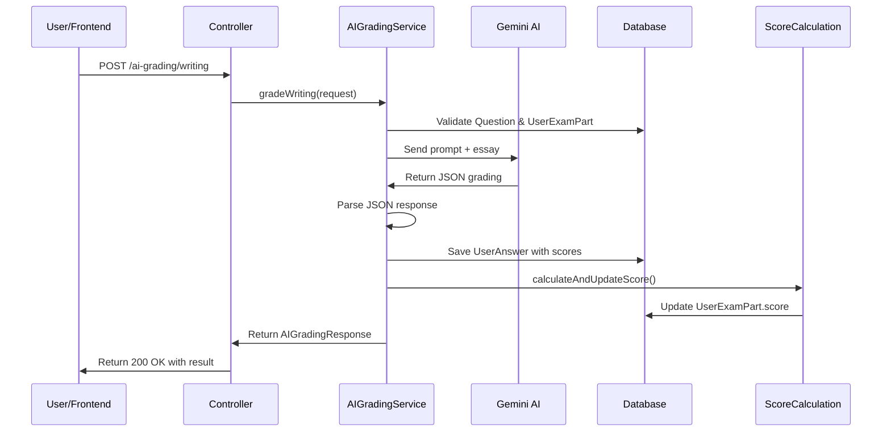

# 🎯 Tổng hợp triển khai AI Grading System

## 📦 Các file đã tạo mới

### 1. DTOs (Data Transfer Objects)
- ✅ `WritingSubmissionRequest.java` - Request để submit bài Writing
- ✅ `SpeakingSubmissionRequest.java` - Request để submit bài Speaking
- ✅ `AIGradingResponse.java` - Response chứa kết quả chấm điểm và phân tích chi tiết

### 2. Service Layer
- ✅ `AIGradingService.java` (interface) - Service interface cho AI grading
- ✅ `AIGradingServiceImpl.java` - Implementation xử lý chấm điểm AI
- ✅ `ScoreCalculationService.java` - Service tính điểm tổng cho UserExamPart
- ✅ `AudioTranscriptionService.java` - Placeholder cho tính năng transcribe audio

### 3. Controller
- ✅ `AIGradingController.java` - REST API endpoints cho AI grading

### 4. Configuration
- ✅ `JacksonConfig.java` - Config ObjectMapper để parse JSON

### 5. Tests
- ✅ `AIGradingServiceImplTest.java` - Integration tests

### 6. Documentation
- ✅ `AI_GRADING_README.md` - Tài liệu chi tiết đầy đủ
- ✅ `QUICK_START_AI_GRADING.md` - Hướng dẫn bắt đầu nhanh
- ✅ `AI_Grading_Postman_Collection.json` - Postman collection để test

## 🔧 Các file đã chỉnh sửa

### 1. pom.xml
- ✅ Sửa dependency Spring AI từ `spring-ai-openai:0.8.1` → `spring-ai-openai-spring-boot-starter:1.0.0-M4`
- ✅ Thêm Spring Milestones repository
- ✅ Thêm property `spring-ai.version`

### 2. application.yaml
- ✅ Sửa lỗi format YAML: `model:gemini-2.0-flash` → `model: gemini-2.0-flash` (thêm space)

### 3. ErrorCode.java
- ✅ Thêm các error codes mới:
  - `USER_EXAM_PART_NOT_FOUND`
  - `INVALID_QUESTION_TYPE`
  - `INVALID_SKILL_TYPE`
  - `USER_ANSWER_NOT_FOUND`
  - `TRANSCRIPT_REQUIRED`
  - `AI_RESPONSE_PARSE_ERROR`

## 🎨 Kiến trúc hệ thống

```
┌─────────────────────────────────────────────┐
│         Frontend (React/Angular)            │
└──────────────────┬──────────────────────────┘
                   │ HTTP REST API
┌──────────────────▼──────────────────────────┐
│      AIGradingController                     │
│  - POST /ai-grading/writing                  │
│  - POST /ai-grading/speaking                 │
│  - POST /ai-grading/regrade/{id}             │
└──────────────────┬──────────────────────────┘
                   │
┌──────────────────▼──────────────────────────┐
│      AIGradingServiceImpl                    │
│  - gradeWriting()                            │
│  - gradeSpeaking()                           │
│  - regradeAnswer()                           │
│  - callAIForWritingGrading()                 │
│  - callAIForSpeakingGrading()                │
└──────────────────┬──────────────────────────┘
                   │
        ┌──────────┴──────────┐
        │                     │
┌───────▼──────┐    ┌─────────▼─────────┐
│  Spring AI   │    │ ScoreCalculation  │
│  + Gemini    │    │     Service       │
└──────────────┘    └───────────────────┘
        │                     │
        └──────────┬──────────┘
                   │
┌──────────────────▼──────────────────────────┐
│           Database (MySQL)                   │
│  - questions                                 │
│  - user_answers                              │
│  - user_exam_parts                           │
└──────────────────────────────────────────────┘
```

## 🔄 Luồng chấm bài Writing



## 🎯 Tính năng chính

### ✅ Đã hoàn thành
1. **Chấm bài Writing**
   - Nhận văn bản từ học viên
   - Phân tích Grammar, Vocabulary, Coherence
   - Feedback chi tiết bằng tiếng Việt
   - Chấm điểm theo thang 100

2. **Chấm bài Speaking**
   - Nhận transcript (hoặc audio URL)
   - Phân tích Pronunciation, Fluency, Vocabulary, Grammar
   - Ước tính WPM (Words Per Minute)
   - Feedback chi tiết

3. **Tính điểm tổng**
   - Tự động tính điểm trung bình cho UserExamPart
   - Tính completion percentage
   - Kiểm tra trạng thái hoàn thành

4. **Regrade**
   - Cho phép chấm lại bài đã submit
   - Hữu ích khi cập nhật AI model

5. **Error Handling**
   - Validate đầy đủ input
   - Custom exception handling
   - Meaningful error messages

### 🚧 Cần triển khai tiếp
1. **Audio Transcription**
   - Tích hợp Whisper API (OpenAI)
   - Hoặc Google Speech-to-Text
   - Hoặc Azure Speech Service

2. **Performance Optimization**
   - Cache AI responses
   - Async processing với CompletableFuture
   - Batch processing

3. **Advanced Features**
   - Plagiarism detection
   - Progress tracking
   - Custom rubrics
   - Export reports (PDF)

## 📊 Tiêu chí chấm điểm

### Writing Assessment Rubric
| Criterion | Weight | Description |
|-----------|--------|-------------|
| Grammar | 25% | Accuracy and range of grammatical structures |
| Vocabulary | 25% | Range, accuracy, and appropriateness |
| Coherence | 25% | Logical flow and paragraph organization |
| Task Achievement | 25% | Addressing the question requirements |

### Speaking Assessment Rubric
| Criterion | Weight | Description |
|-----------|--------|-------------|
| Pronunciation | 25% | Clarity and intelligibility |
| Fluency | 25% | Speaking pace and hesitation |
| Vocabulary | 25% | Lexical range and appropriateness |
| Grammar | 25% | Grammatical accuracy and complexity |

## 🔐 Security Considerations

- ✅ Authentication required (JWT)
- ✅ Input validation với Jakarta Validation
- ✅ SQL Injection prevention (JPA/Hibernate)
- ✅ XSS prevention (JSON responses)
- ⚠️ TODO: Rate limiting để tránh abuse
- ⚠️ TODO: Audit logging cho AI requests

## 📈 Monitoring & Logging

Các logs quan trọng:
```java
log.info("Grading writing submission for question: {}", questionId);
log.info("Writing graded successfully. Score: {}", score);
log.error("Failed to parse AI response", exception);
```

Recommended monitoring:
- Response time của AI API
- Success/failure rate
- Average scores
- Number of requests per day

## 💰 Chi phí ước tính

### Gemini 2.0 Flash
- Free tier: 15 requests/minute, 1500 requests/day
- Paid tier: Starting from $0.075 per 1M characters

### Ước tính cho 1000 học viên/ngày
- Mỗi bài ~500 từ (3000 characters)
- Writing + Speaking = 6000 characters/student
- Total: 6M characters/day
- Cost: ~$0.45/day = $13.5/month

Rất rẻ! 🎉

## 🧪 Testing Strategy

### Unit Tests
- Mock ChatModel responses
- Test prompt generation
- Test JSON parsing

### Integration Tests
- Test với real AI API (limited)
- Test database transactions
- Test error scenarios

### Manual Testing
- Swagger UI
- Postman collection
- Frontend integration

## 📝 API Endpoints Summary

| Method | Endpoint | Description |
|--------|----------|-------------|
| POST | `/api/ai-grading/writing` | Submit & grade writing |
| POST | `/api/ai-grading/speaking` | Submit & grade speaking |
| POST | `/api/ai-grading/regrade/{id}` | Re-grade existing answer |

## 🎓 Prompts Engineering

### Writing Prompt Strategy
- Role: IELTS/TOEFL examiner
- Output format: Structured JSON
- Language: Vietnamese feedback
- Criteria: Grammar, Vocabulary, Coherence, Task Achievement

### Speaking Prompt Strategy
- Role: Speaking examiner
- Input: Transcript text
- Output: JSON with pronunciation, fluency, vocab, grammar
- Estimate WPM

## 🚀 Deployment Checklist

- [x] Code complete
- [x] Unit tests
- [ ] Integration tests with real AI
- [x] Documentation
- [ ] Performance testing
- [ ] Security audit
- [ ] Staging deployment
- [ ] Production deployment

## 📚 References

- [Spring AI Documentation](https://docs.spring.io/spring-ai/reference/)
- [Gemini API](https://ai.google.dev/gemini-api/docs)
- [IELTS Writing Band Descriptors](https://www.ielts.org/for-organisations/ielts-scoring-in-detail)
- [TOEFL Speaking Rubrics](https://www.ets.org/toefl/test-takers/ibt/scores/speaking-rubrics.html)

## 🎉 Kết luận

Hệ thống AI Grading đã được triển khai thành công với đầy đủ tính năng cơ bản:
- ✅ Chấm Writing tự động
- ✅ Chấm Speaking (với transcript)
- ✅ Phân tích chi tiết
- ✅ Feedback tiếng Việt
- ✅ Tính điểm tổng tự động

**Next Steps:**
1. Test với dữ liệu thực
2. Thu thập feedback từ giáo viên
3. Fine-tune prompts
4. Implement audio transcription
5. Optimize performance

---

**Developed by:** Dương Xuân Hưng  
**Date:** November 2025  
**Version:** 1.0.0
